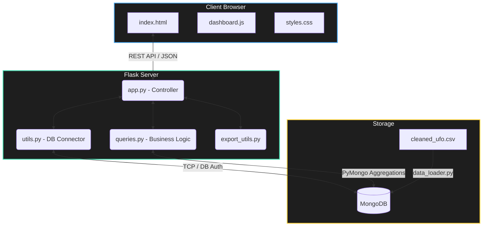

<div align="center">

# 🛸 UFO Sightings Analytics Dashboard

**End-to-End Enterprise Grade Analytics for Extraterrestrial Encounters**

[](https://www.python.org/downloads/release/python-390/)
[](https://flask.palletsprojects.com/)
[](https://www.mongodb.com/)
[](https://plotly.com/javascript/)
[](https://opensource.org/licenses/MIT)


*Explore the unknown. Filter, analyze, and visualize thousands of reported sightings across the globe using interactive high-performance charts.*

</div>

---

## 🌟 Supercharged Features

Experience a completely interactive data playground designed for deep exploration of UFO phenomena:

- **🌍 Global Geospatial Mapping:** Instantly locate sightings across different regions with fully interactive Geo-scatter maps.
- **⚡ Lightning-Fast Filtering:** Slice data dynamically by Country, State, UFO Shape, Duration, and Year using optimized RESTful endpoints.
- **📊 6+ Dynamic Visualizations:** Dive into temporal trends, shape distributions, and duration histograms via beautifully rendered `Plotly.js` components.
- **🗄️ NoSQL Scalability:** Powered by robust MongoDB queries ensuring rapid data retrieval even for massive datasets.
- **📥 One-Click CSV Export:** Export aggressively filtered datasets instantly for offline analysis.

---

## 🛠️ The Technology Stack

This project implements a robust **Full-Stack Data Engineering Pipeline**, separating concerns perfectly for maximum maintainability:

| Layer | Technologies Used | Description |
| :--- | :--- | :--- |
| **Frontend UI** | `HTML5`, `CSS3`, `Vanilla JS` | Lightweight, native browser technologies without bloat. |
| **Visualizations**| `Plotly.js` | Industry-leading WebGL accelerated graphing library. |
| **Backend API** | `Python 3`, `Flask`, `Werkzeug` | High-performance WSGI web application framework. |
| **Database** | `MongoDB`, `PyMongo` | Document-oriented NoSQL db perfect for messy geospatial data. |
| **Data Eng.** | `Pandas` | Pre-processing, cleaning, and transforming the raw `.csv` reports. |

---

## 🏗️ System Architecture

Our loosely coupled micro-architecture ensures scalability and ease of debugging.



*(Above: A high-level overview of our request/response lifecycle bridging UI elements to the NoSQL engine.)*

---

## 📂 Deep Dive: Project Structure

```bash
ufo-analysis-bda-assignment/
│
├── 🧠 Backend Services
│   ├── app.py             # 🚦 The Brain: HTTP server, route definitions, error handling
│   ├── utils.py           # 🔗 The Bridge: Mongo connection singleton & timeout logic
│   ├── queries.py         # 🔍 The Engine: Aggregation pipelines, filtering, logic
│   ├── export_utils.py    # 📦 The Packer: In-memory translation of BSON to CSV bytes
│   └── data_loader.py     # 🚚 The Loader: ETL script mapping CSV directly into MonogDB
│
├── 🎨 Frontend Assets
│   └── static/
│       ├── index.html     # 🖼️ The Canvas: Layout container & DOM structure
│       ├── dashboard.js   # ⚡ The Nerves: AJAX fetching, event listeners, Plotly rendering
│       └── styles.css     # 💅 The Paint: Custom dark-mode optimized aesthetics
│
├── 🗃️ Data & Config
│   ├── cleaned_ufo.csv    # 📜 The Truth: 15MB+ of sanitized, raw UFO sighting reports
│   └── requirements.txt   # 🛠️ The Blueprint: Strict version pinning for reproducible builds
```

---

## ⚙️ Quickstart & Local Setup

Ready to spin up the control center? Follow these steps to get the dashboard live on your machine.

### 1️⃣ Prerequisites
Ensure you have the following installed:
* **Python 3.9+**
* **MongoDB Community Server** (running locally on port `27017`)

### 2️⃣ Clone & Install dependencies
```bash
# Clone the repository (if applicable)
git clone <your-repo-link>
cd ufo-analysis-bda-assignment

# Create a virtual environment (Recommended)
python -m venv venv
source venv/bin/activate  # On Windows use: venv\Scripts\activate

# Install strictly pinned dependencies
pip install -r requirements.txt
```

### 3️⃣ Data Injection Pipeline
Populate your local MongoDB instance with our curated 15MB dataset:
```bash
python data_loader.py
```
> **Note:** This bypasses costly datetime parsing to inject `cleaned_ufo.csv` exactly as-is into the `ufo_database.sightings` collection, ensuring 1:1 data integrity.

### 4️⃣ Ignite the Server
```bash
python app.py
```
> 🎉 **Success!** Navigate your browser to `http://localhost:5000` to start exploring.

---

## 📡 API Reference & Endpoints

Our backend strictly follows RESTful principles, emitting pristine JSON payloads.

| Method | Endpoint | Description | Payload Form |
| :--- | :--- | :--- | :--- |
| `GET` | `/` | Serves the hyper-optimized `index.html` payload. | *None* |
| `GET` | `/distinct/<field>` | Yields a sorted, deduplicated array for dropdowns. Valid fields: `country`, `state`, `shape`. | *None* |
| `POST`| `/filter` | Core query engine. Pushes dynamic Mongo filters & receives truncated documents (lim: 10k). | `{"country": "us", "yearRange": [1990, 2010], ...}` |
| `POST`| `/summary` | Aggregates high-level metrics (totals, avg durations) rapidly. | *Matches Filter Payload* |
| `POST`| `/export/csv` | Streams in-memory chunked bytes directly to client as `.csv`. | *Matches Filter Payload* |

---

## 🔮 Future Roadmap & Customizations

This architecture was explicitly chosen for absolute isolation of concerns, making feature extension trivial:
- **Real-time Event Streaming:** Connect a Kafka pipeline into `data_loader.py` to stream live MUFON reports.
- **Vector Search:** Extend `utils.py` to leverage **Atlas Vector Search** on the `comments` field for semantic NLP context searching.
- **Authentication Wrapper:** Wrap `app.py` blueprints with JWT validators to secure `.csv` export endpoints.

---

<div align="center">
  <p><i>We are not alone. Let the data speak for itself.</i> 🛸</p>
  <p>Maintained with ❤️ for Large Scale Data Analytics.</p>
</div>